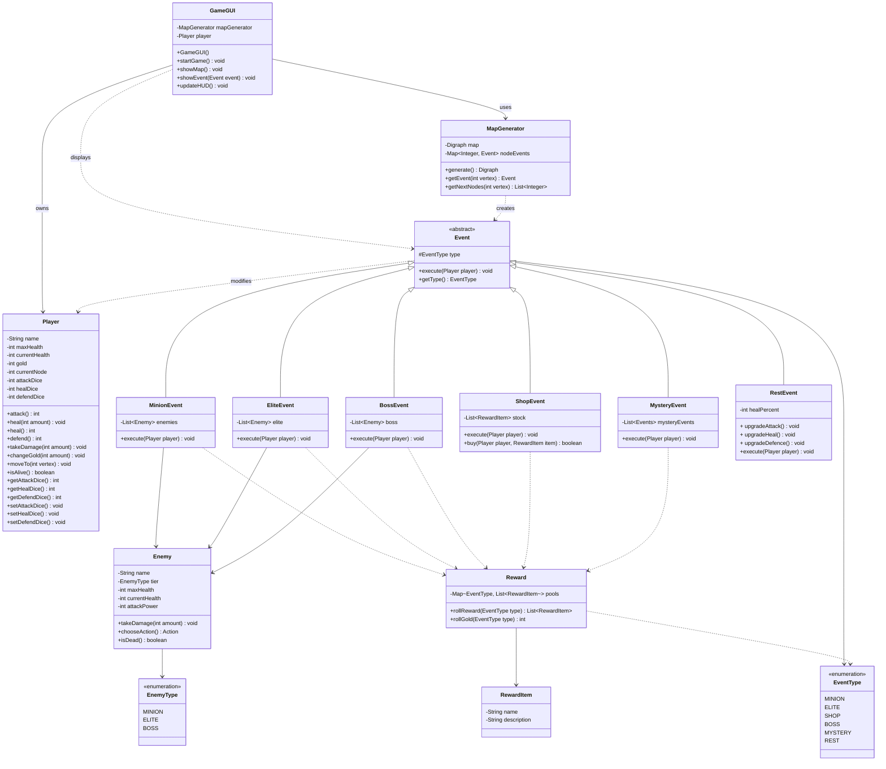

```mermaid
classDiagram
    direction TB

    class GameGUI {
        -MapGenerator mapGenerator
        -Player player
        +GameGUI()
        +startGame() void
        +showMap() void
        +showEvent(Event event) void
        +updateHUD() void
    }

    class MapGenerator {
        -Digraph map
        -Map~Integer, Event~ nodeEvents
        +generate() Digraph
        +getEvent(int vertex) Event
        +getNextNodes(int vertex) List~Integer~
    }

    class Player {
        -String name
        -int maxHealth
        -int currentHealth
        -int gold
        -int currentNode
        -int attackDice
        -int healDice
        -int defendDice
        +attack() int
        +heal(int amount) void
        +heal() int
        +defend() int
        +takeDamage(int amount) void
        +changeGold(int amount) void
        +moveTo(int vertex) void
        +isAlive() boolean
        +getAttackDice() int
        +getHealDice() int
        +getDefendDice() int
        +setAttackDice() void
        +setHealDice() void
        +setDefendDice() void
    }

    class Event {
        <<abstract>>
        #EventType type
        +execute(Player player) void
        +getType() EventType
    }

    class MinionEvent {
        -List~Enemy~ enemies
        +execute(Player player) void
    }

    class EliteEvent {
        -List~Enemy~ elite
        +execute(Player player) void
    }

    class BossEvent {
        -List~Enemy~ boss
        +execute(Player player) void
    }

    class ShopEvent {
        -List~RewardItem~ stock
        +execute(Player player) void
        +buy(Player player, RewardItem item) boolean
    }

    class MysteryEvent {
        -List~Events~ mysteryEvents
        +execute(Player player) void
    }

    class RestEvent {
        -int healPercent
        + upgradeAttack() void 
        + upgradeHeal() void 
        + upgradeDefence() void 
        +execute(Player player) void
    }

    class Enemy {
        -String name
        -EnemyType tier
        -int maxHealth
        -int currentHealth
        -int attackPower
        +takeDamage(int amount) void
        +chooseAction() Action
        +isDead() boolean
    }

    class Reward {
        -Map~EventType, List~RewardItem~~ pools
        +rollReward(EventType type) List~RewardItem~
        +rollGold(EventType type) int
    }

    class RewardItem {
        -String name
        -String description
    }

    class EventType {
        <<enumeration>>
        MINION
        ELITE
        SHOP
        BOSS
        MYSTERY
        REST
    }

    class EnemyType {
        <<enumeration>>
        MINION
        ELITE
        BOSS
    }

    GameGUI --> MapGenerator : uses
    GameGUI --> Player : owns
    GameGUI ..> Event : displays

    MapGenerator ..> Event : creates

    Event <|-- MinionEvent
    Event <|-- EliteEvent
    Event <|-- BossEvent
    Event <|-- ShopEvent
    Event <|-- MysteryEvent
    Event <|-- RestEvent
    Event --> EventType
    Event ..> Player : modifies

    MinionEvent --> Enemy
    EliteEvent --> Enemy
    BossEvent --> Enemy
    Enemy --> EnemyType

    MinionEvent ..> Reward
    EliteEvent ..> Reward
    BossEvent ..> Reward
    ShopEvent ..> Reward
    MysteryEvent ..> Reward

    Reward --> RewardItem
    Reward ..> EventType
```
